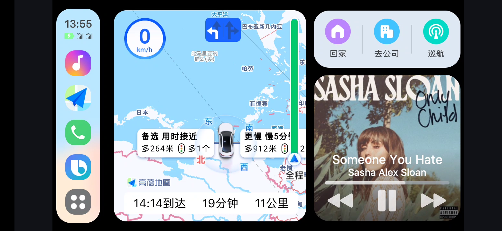
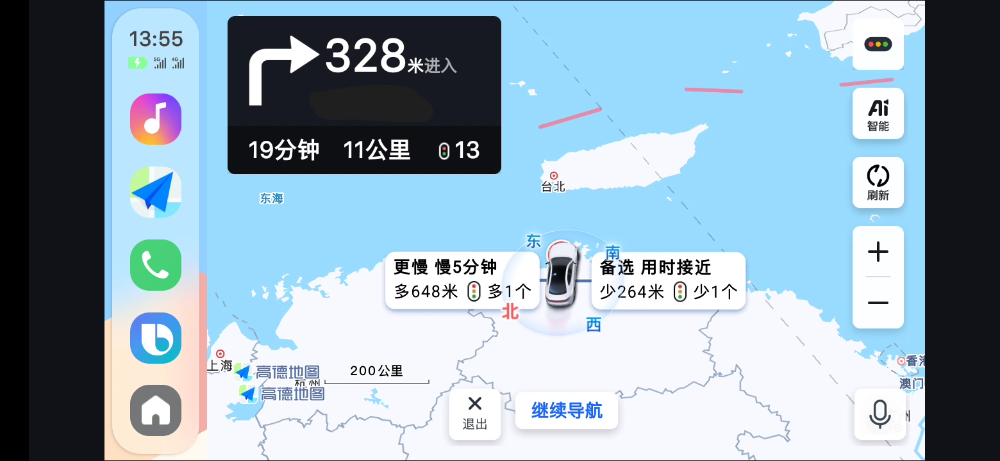
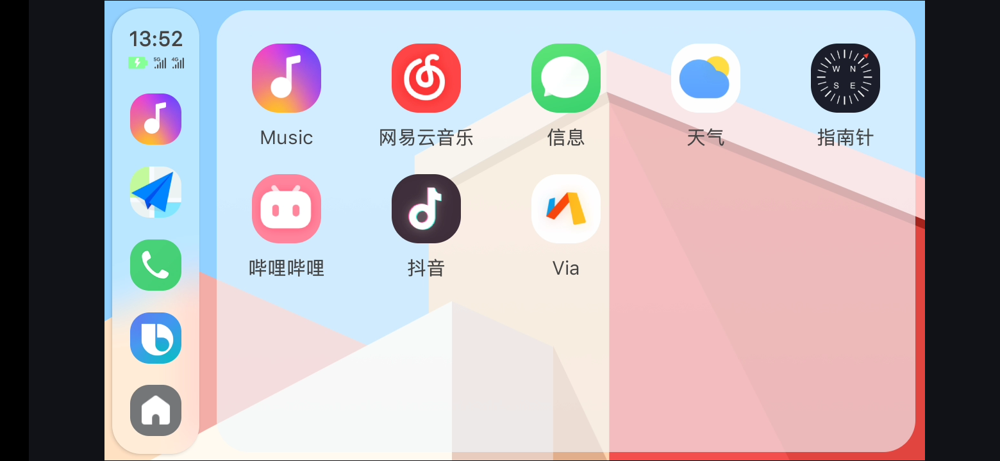
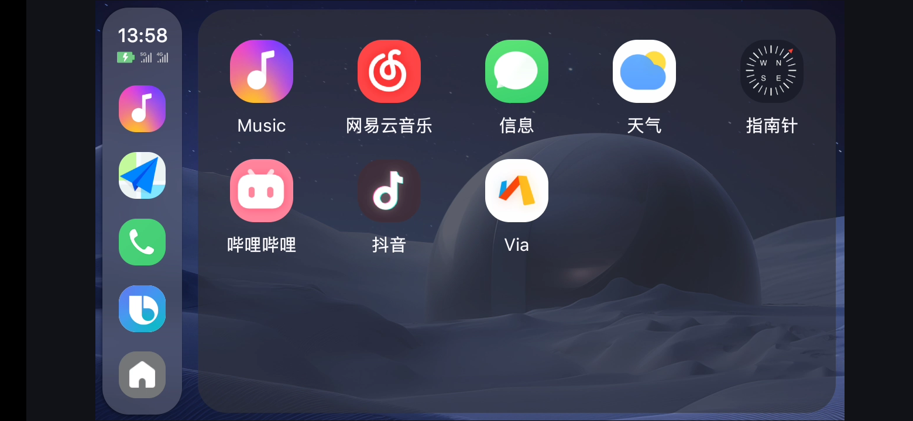
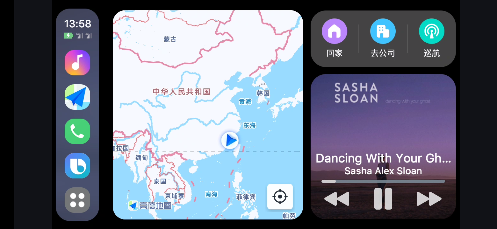
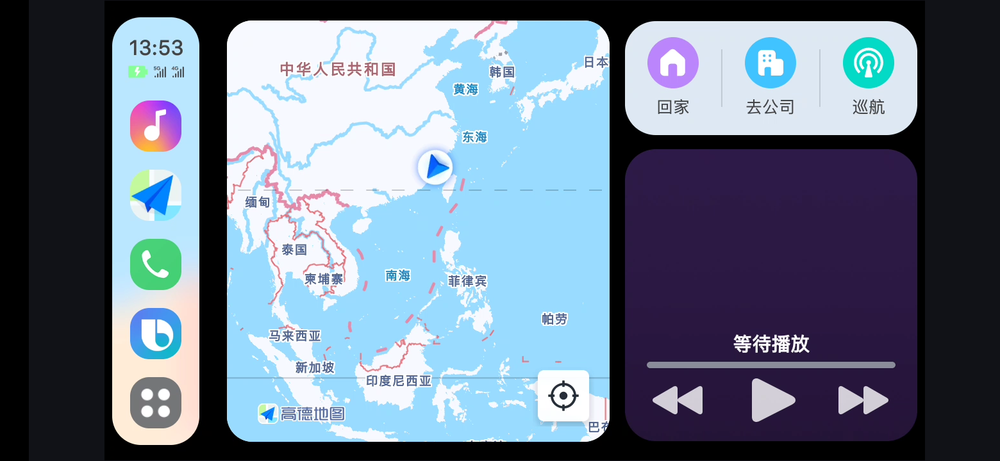

<!--suppress CheckImageSize -->

# OneUI_CarlinkHelper

这是一个<a href="https://github.com/GoGoDuckCoder/CalifeAppLauncherSamsung">车联助手</a>的修改版本
 
相比车联助手增加和修改了:
 
1、可通过小度、Bixby、主页回家、去公司按钮发起手机高德、车机高德的导航; 
2、可通过巡航按钮发起手机高德巡航 
3、右侧音乐窗口覆盖; 
4、界面修改，Dock显示实时电量、充电状态、信号强度 
5、APP设置界面重做 
6、删减一些功能 
注意:APP需要的所有权限均为必要权限，且无联网权限，放心授权即可 

使用方法: 卸载百度地图(与百度地图包名冲突)，安装Carlink Helper即可 
只在OneUI5.1的Carlife+三星版上测试，其他系统若不能使用属正常情况 

 

<h3>
<a href="https://github.com/CelianLH/OneUI_CarlinkHelper/releases/download/release-2024%2F06%2F18/Carlink.Helper_20.2.30_2024.06.18.apk">下载apk</a>
</h3>

 

